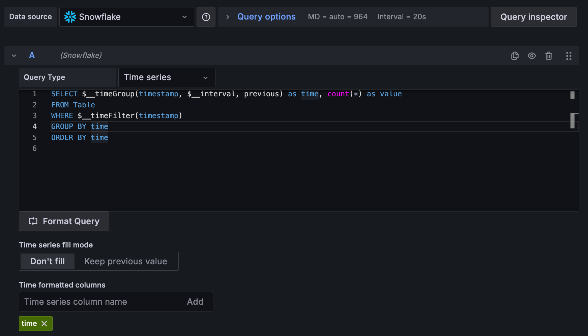

# Snowflake Grafana Data Source

[](https://github.com/michelin/snowflake-grafana-datasource/actions?query=workflow%3A%22CI%22)

With the Snowflake plugin, you can visualize your Snowflake data in Grafana and build awesome chart.

## Get started with the plugin

### Set up the Snowflake Data Source
#### Install the Data Source

1. Install the plugin into the grafana plugin folder:
```shell
grafana-cli --pluginUrl https://github.com/michelin/snowflake-grafana-datasource/releases/latest/download/snowflake-grafana-datasource.zip plugins install michelin-snowflake-datasource
```
or
```shell
cd /var/lib/grafana/plugins/
wget https://github.com/michelin/snowflake-grafana-datasource/releases/latest/download/snowflake-grafana-datasource.zip
unzip snowflake-grafana-datasource.zip
```

2. Edit the grafana configuration file to allow unsigned plugins:
* Linux：/etc/grafana/grafana.ini
* macOS：/usr/local/etc/grafana/grafana.ini
```shell
[plugins]
allow_loading_unsigned_plugins = michelin-snowflake-datasource
```
Or with docker
```shell
docker run -d \
-p 3000:3000 \
-v "$(pwd)"/grafana-plugins:/var/lib/grafana/plugins \
--name=grafana \
-e "GF_PLUGINS_ALLOW_LOADING_UNSIGNED_PLUGINS=michelin-snowflake-datasource" \
grafana/grafana
```

3. Restart grafana

#### Configure the Datasource

* Open the side menu by clicking the Grafana icon in the top header.
* In the side menu under the Configuration icon you should find a link named Data Sources.
* Click the `+ Add data source` button in the top header.
* Select Snowflake.

Add your authentication and [configuration details](https://docs.snowflake.com/en/user-guide/jdbc-configure.html#connection-parameters). <br/>


Available configuration fields are as follows:

 Name                     | Description      
------------------------- | ------------
 Account Name             | Specifies the full name of your account (provided by Snowflake) 
 Username                 | Specifies the login name of the user for the connection.
 Password                 | Specifies the password for the specified user.
 Role (Optional)          | Specifies the default access control role to use in the Snowflake session initiated by Grafana.
 Warehouse (Optional)     | Specifies the virtual warehouse to use once connected. 
 Database (Optional)      | Specifies the default database to use once connected. 
 Schema (Optional)        | Specifies the default schema to use for the specified database once connected. 
 Extra Options (Optional) | Specifies a series of one or more parameters, in the form of `<param>=<value>`, with each parameter separated by the ampersand character (&), and no spaces anywhere in the connection string. 

#### Supported Macros

Macros can be used within a query to simplify syntax and allow for dynamic parts.

Macro example                                          | Description
------------------------------------------------------ | -------------
`$__time(dateColumn)`                                  | Will be replaced by an expression to convert to a UNIX timestamp and rename the column to `time`. For example, *TRY_TO_TIMESTAMP(dateColumn) as time*
`$__timeEpoch(dateColumn)`                             | Will be replaced by an expression to convert to a UNIX timestamp and rename the column to `time`.
`$__timeFilter(dateColumn)`                            | Will be replaced by a time range filter using the specified column name. For example, *dateColumn BETWEEN 1494410783 AND 1494410983*
`$__timeFrom()`                                        | Will be replaced by the start of the currently active time selection. For example, *1494410783*
`$__timeTo()`                                          | Will be replaced by the end of the currently active time selection. For example, *1494410983*
`$__timeGroup(dateColumn,'5m')`                        | Will be replaced by an expression usable in GROUP BY clause. For example, *floor(extract(epoch from dateColumn)/120)*120*
`$__timeGroup(dateColumn,'5m', 0)`                     | Same as above but with a fill parameter so missing points in that series will be added by grafana and 0 will be used as value.
`$__timeGroup(dateColumn,'5m', NULL)`                  | Same as above but NULL will be used as value for missing points.
`$__timeGroup(dateColumn,'5m', previous)`              | Same as above but the previous value in that series will be used as fill value if no value has been seen yet NULL will be used (only available in Grafana 5.3+).
`$__timeGroupAlias(dateColumn,'5m')`                   | Will be replaced identical to $__timeGroup but with an added column alias `time` (only available in Grafana 5.3+).
`$__unixEpochFilter(dateColumn)`                       | Will be replaced by a time range filter using the specified column name with times represented as Unix timestamp. For example, *dateColumn > 1494410783 AND dateColumn < 1494497183*
`$__unixEpochNanoFilter(dateColumn)`                   | Will be replaced by a time range filter using the specified column name with times represented as nanosecond timestamp. For example, *dateColumn > 1494410783152415214 AND dateColumn < 1494497183142514872*
`$__unixEpochNanoFrom()`                               | Will be replaced by the start of the currently active time selection as nanosecond timestamp. For example, *1494410783152415214*
`$__unixEpochNanoTo()`                                 | Will be replaced by the end of the currently active time selection as nanosecond timestamp. For example, *1494497183142514872*
`$__unixEpochGroup(dateColumn,'5m', [fillmode])`       | Same as $__timeGroup but for times stored as Unix timestamp (only available in Grafana 5.3+).
`$__unixEpochGroupAlias(dateColumn,'5m', [fillmode])`  | Same as above but also adds a column alias (only available in Grafana 5.3+).


#### Write Queries

Create a panel in a dashboard and select a Snowflake Data Source to start using the query editor.

Select a query type 'Time Series' or 'Table'.

For Time series query:
* Date / time column can appear anywhere in the query as long as it is included (you must define the time formatted columns name)
* A numerical column must be included.



##### Layout of a query

*Simple query*
```sql
SELECT
  <time_column> as time,
  <numerical_column>
FROM
  <table>
WHERE
  $__timeFilter(<time_column>) 
  AND $<variable> = 'xxxxx' -- custom grafana variables start with dollar sign
```

*SQL Query Group By Interval*

```sql
SELECT
  $__timeGroup(<time_column>, $__interval), -- group time by interval
  <numerical_column>
FROM
  <table>
WHERE
  $__timeFilter(<time_column>)
  AND $<variable> = 'xxxxx'
GROUP BY 
  <time_column>
```

#### Create an annotation

Annotations allow you to overlay events on a graph.
To create an annotation, in the dashboard settings click "Annotations", and "New".


## Development

The snowflake datasource is a data source backend plugin composed of both frontend and backend components.

### Frontend

1. Install dependencies

   ```bash
   yarn install
   ```

2. Build plugin in development mode or run in watch mode

   ```bash
   yarn dev
   ```

   or

   ```bash
   yarn watch
   ```

3. Build plugin in production mode

   ```bash
   yarn build
   ```

### Backend

1. Build backend plugin binaries for Linux, Windows and Darwin:

   ```bash
   mage -v
   ```

2. List all available Mage targets for additional commands:

   ```bash
   mage -l
   ```
   
## License

Snowflake grafana plugin has been released under Apache License 2.0. Please, refer to the LICENSE file for further information.
